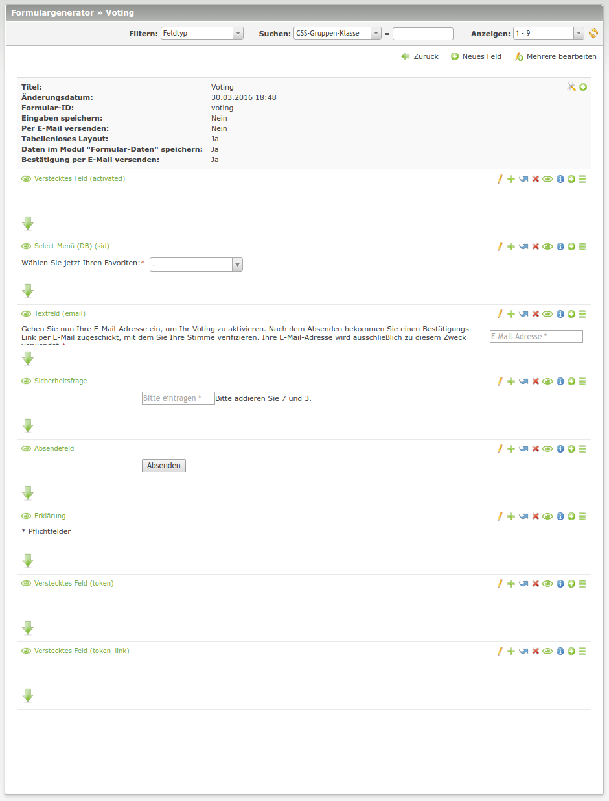
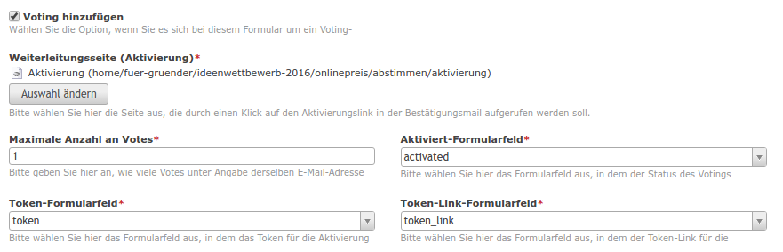
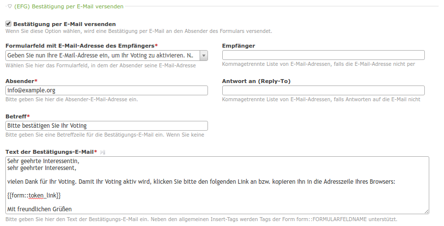
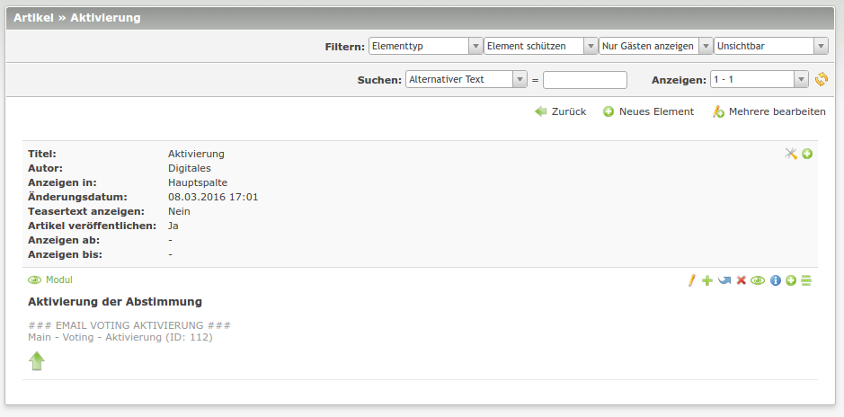

# Contao E-Mail Voting

The module offers functionality for using an EFG form to be a voting form.

In order to offer a certain amount of protection against fake votes, every vote needs to be confirmed via email.

Only one vote per email is possible.

## Technical instruction

### Step 1
Add the necessary fields to a new EFG form:

### Step 2

Activate "Save formdata (efg)" in the form configuration (alias field could be email).

### Step 3
After adding the necessary fields, link them in the form's config:

In order to confirm the voting, an email has to be sent:

### Step 4
The activation site needs to contain an activation module:

*The module doesn't need any further configuration*

## Features

### Modules

Name | Description
---- | -----------
ModuleEmailVotingActivation | A module taking a token in the GET parameter to activate the voting.

### Hooks

Name | Arguments | Description
---- | --------- | -----------
processEfgFormData -> generateTokenLink | $objTemplate, $arrItem, $objModule | Adds a token link in order to use it in the confirmation email after a voting
validateFormField -> validateVotingEmailFormField | $objWidget, $intId | Checks for existing votings for a certain email address
